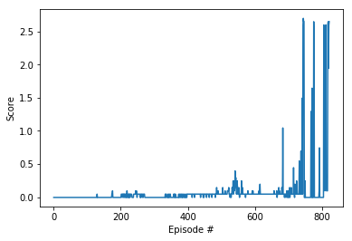

[//]: # (Image References)


[image1]: https://user-images.githubusercontent.com/10624937/42135623-e770e354-7d12-11e8-998d-29fc74429ca2.gif "Trained Agent"


# Project 2: Continuous Control

### Introduction


In this environment, two agents control rackets to bounce a ball over a net. If an agent hits the ball over the net, it receives a reward of +0.1. If an agent lets a ball hit the ground or hits the ball out of bounds, it receives a reward of -0.01. Thus, the goal of each agent is to keep the ball in play.

The observation space consists of 8 variables corresponding to the position and velocity of the ball and racket. Each agent receives its own, local observation. Two continuous actions are available, corresponding to movement toward (or away from) the net, and jumping.

![Trained Agent][image1]

The task is episodic, and in order to solve the environment, your agents must get an average score of +0.5 (over 100 consecutive episodes, after taking the maximum over both agents). Specifically,

-   After each episode, we add up the rewards that each agent received (without discounting), to get a score for each agent. This yields 2 (potentially different) scores. We then take the maximum of these 2 scores.
-   This yields a single  **score**  for each episode.

The environment is considered solved, when the average (over 100 episodes) of those  **scores**  is at least +0.5.


### Learning Algorithm


For solving the problem, I used the Deep Deterministic Policy Gradient(DDPG) algorithm to solve the environment.

The algorithm works by having the agent act as both "players" in the environment and collecting rewards. This works because of how the environment is set up, since each "player" receives its own local observation and the rewards are identical, it becomes possible to have the same agent control both "players". Therefore, we can use experience of one "player" to train the other.

These experiences are then stored in a buffer and used at a later time to train the neural networks. A neural network, called actor network is used to approximate the optimal policy from which the best believed action is selected.

During training another neural network, called the critic network is used to estimate value function which is then used to evaluate the action selected by the actor network.

 By using these two networks in tandem, the agent is able to solve complex environments that contain both a continuous state and action space.

An Ornstein-Uhlenbeck process is used to generate random noise which is then scaled by a decaying epsilon value.


#### Model architecture

In my implementation the Actor network contains two hidden layers of 128 and 256 units with ReLU activation applied to both layers and a tanh on the end.

In addition, a batch normalizsation is applied to the input and between the hidden layers.

The Critical network also has two hidden layers with 128 and 256 units and Leaky ReLU Activation on both layers.


#### DDPG hyper-parameters
```
BUFFER_SIZE = int(1e6)  # replay buffer size
BATCH_SIZE = 256        # minibatch size
GAMMA = 0.99            # discount factor
TAU = 1e-3              # for soft update of target parameters
LR_ACTOR = 1e-3         # learning rate of the actor
LR_CRITIC = 1e-3        # learning rate of the critic
WEIGHT_DECAY = 0        # critic weight decay
UPDATE_EVERY = 20       # timesteps between updates
NUM_UPDATES =  15       # num of update passes when updating
EPSILON = 1             # epsilon for the noise process added to the actions
EPSILON_DECAY = 0.9999  # decay for epsilon above
```


### Plots of rewards
```
Episode 50	Average Score: -0.00
Episode 100	Average Score: -0.00
Episode 150	Average Score: -0.00
Episode 200	Average Score: -0.00
Episode 250	Average Score: 0.01
Episode 300	Average Score: 0.02
Episode 350	Average Score: 0.01
Episode 400	Average Score: 0.01
Episode 450	Average Score: 0.03
Episode 500	Average Score: 0.04
Episode 550	Average Score: 0.07
Episode 600	Average Score: 0.07
Episode 650	Average Score: 0.05
Episode 700	Average Score: 0.06
Episode 750	Average Score: 0.20
Episode 800	Average Score: 0.26

Environment solved in 821 episodes!
Average Score: 0.50
```



After training, the environment is solved with a good score.
Total score (averaged over agents) this episode: 2.650000039488077

### Ideas for improvements

 - Change network sizes and choose different hyper-parameters
 - Try other algorithms like PPO, A3C or D4PG
 - Try different replay buffer for actor/critic
